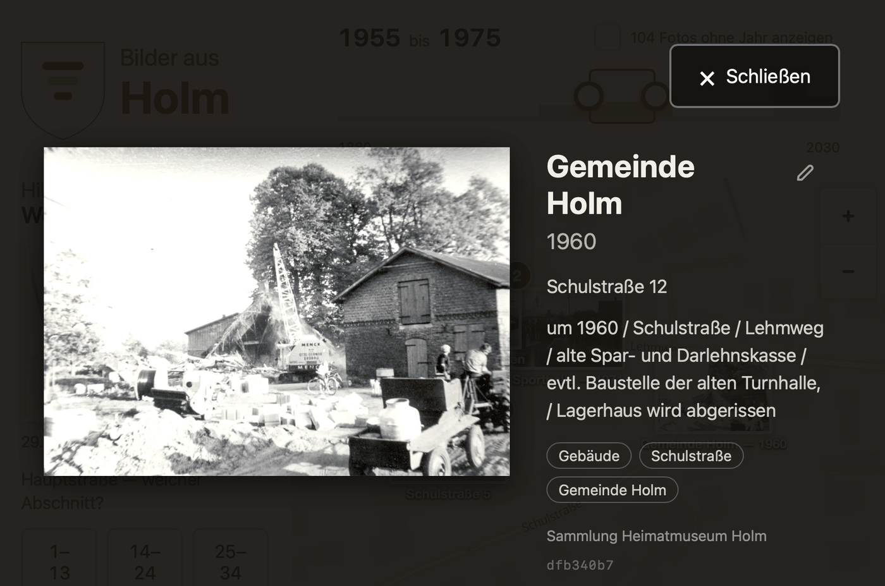
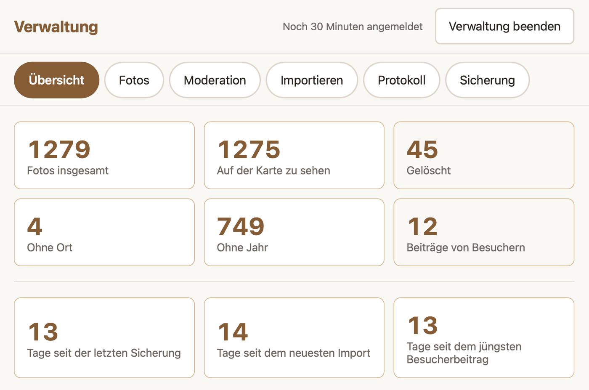

<!-- translated-from: README.md -->
<!-- source-sha: e131fcc85fa2191eb22026002697a0e3b61d4771f1110e52143bc725863de94c -->

# Kiekmap

[](https://github.com/nordfisch/kiekmap/actions/workflows/check.yml)
[](LICENSE)

> **Dokumentation:** [nordfisch.github.io/kiekmap/de/](https://nordfisch.github.io/kiekmap/de/) —
> die Dateien unter `docs/`, in beiden Sprachen, gebaut vom neuesten Tag.
>
> **In English:** [README.md](README.md) — das Repository ist englisch, diese Seite und die
> Anleitungen unter [docs/](docs/) sind die deutschen Fassungen.

Historische Ortsfotos auf einer Karte entdecken, Jahrzehnt für Jahrzehnt. Ein Touchscreen-Kiosk
fürs Heimatmuseum: Läuft offline auf einem Raspberry Pi, lässt sich an jeden Ort anpassen, und die
Besucher ergänzen, was fehlt. Ein Freizeitprojekt von Kalle Erlhoff für das Heimatmuseum Holm,
erstellt in Zusammenarbeit mit Anthropic Claude Code.

> **Achtung: Arbeitsstand.** Was hier liegt, ist der Stand, der beim **Aufbau des Erstbestands**
> entstanden ist — 929 historische Fotos, eingelesen, bereinigt und durchgesehen. Gelaufen ist das
> bisher **ausschließlich lokal**: als Entwicklungsserver und in Containern, beides auf einem Mac.
>
> **Auf einem Raspberry Pi oder einem Webserver wurde es bisher noch nicht installiert.** Alles
> unter `deploy/pi/` ist ohne Gerät geschrieben — die Syntax stimmt, ausgeführt wurde nichts.
> Ungeprüft sind damit der Kiosk-Betrieb, der USB-Weg der Sicherung und das Verhalten nach
> Neustart und Stromausfall. Der erste echte Aufbau ist zugleich die Abnahme:
> [Issue #18](https://github.com/nordfisch/kiekmap/issues/18) und
> [Issue #22](https://github.com/nordfisch/kiekmap/issues/22).
>
> Geprüft ist, was sich ohne Gerät prüfen lässt: Die Container bauen und laufen, die Seite fragt
> nichts Fremdes an, und die Testreihe ist grün.

Das Gerät soll im Museum stehen, **vollständig offline** im Kiosk-Modus laufen und gesichert
werden, indem man einen USB-Stick einsteckt und einen Knopf drückt.

## Was der Besucher sieht


*Das Gerät in Holm. `KIEKMAP_LANGUAGE=en` stellt denselben Schirm auf Englisch.*

Karte zoomen und den Zeitraum-Schieber bewegen filtert die Fotos. Der Schieber steht über der
Karte, die er filtert — nicht über dem Beitragsbereich. Links fragt der „Hilf mit"-Bereich nach
fehlenden Angaben — *„Wo ist das?"*, *„Wann war das?"* —, denn bei historischen Scans steht das
nirgends in der Datei. Wer den Ort kennt, ergänzt die Datenbank im Vorbeigehen. Ist nichts mehr
offen, fällt der Bereich weg und die Karte nimmt die volle Breite.

Ein Tipp öffnet ein Foto in voller Größe, mit allem, was darüber bekannt ist: Datierung, Adresse,
Schlagwörter, Bildnachweis — und die Kennung, mit der es sich im Archiv wiederfinden lässt.



Das Wappen führt die linke Spalte an und ist zugleich der Weg in die Verwaltung.

Dahinter liegt der Verwaltungsbereich, den die Ehrenamtlichen ein- bis zweimal im Jahr benutzen:
was der Bestand hat, was noch fehlt, und wie lange die letzte Sicherung her ist.



## Aufbau

| Ordner | Inhalt |
|---|---|
| `backend/` | FastAPI + SQLite: Fotos, Metadaten, Import, API |
| `frontend/` | React + MapLibre: Besucheransicht (`src/kiosk/`) und Admin (`src/admin/`) |
| `tiles/` | Skripte, die die Offline-Karte und die lokale Ortssuche bauen |
| `deploy/` | Docker Compose und die Einrichtung des Raspberry Pi |
| `docs/` | Die ganze Dokumentation — Wegweiser: [docs/museum/index.de.md](docs/museum/index.de.md) |
| `data/` | Laufzeitdaten (nicht im Repo): Datenbank, Fotos, Thumbnails |

## Entwicklung

Voraussetzungen: Python 3.12+, Node 18+, optional Docker.

```bash
make dev
```

Startet Backend (Port 8000, API-Doku unter `/api/docs`) und Frontend (Port 5173) mit Hot Reload.
Vite leitet `/api` an das Backend weiter, sodass in Entwicklung und Betrieb dieselben Pfade gelten.

`make` ohne Ziel zeigt alle Kommandos.

| Kommando | Zweck |
|---|---|
| `make dev` | Backend und Frontend mit Hot Reload |
| `make seed` | Beispielbestand aus `seed/` herstellen — [alles darin ist erfunden](seed/README.md) |
| `make empty` | Den ganzen Fotobestand löschen. Fragt nach und ist nicht rückholbar |
| `make test` | pytest und vitest |
| `make tiles` | Offline-Karte und Ortsindex für die konfigurierte Region bauen |
| `make prod` | Alles in Containern, so wie es auf dem Pi läuft |

Einrichtung im Detail, Sprachregelung, Teststrategie und die Fallstricke, die Zeit gekostet haben:
[docs/developer/development.md](docs/developer/development.md), englisch. Für Coding-Agents: [CLAUDE.md](CLAUDE.md).

**Für einen anderen Ort:** Es genügt, `tiles/region.json` anzupassen und `make tiles && make places`
auszuführen — kein Fork, kein Codeeingriff. Schritt für Schritt in
[docs/museum/adaption.de.md](docs/museum/adaption.de.md).

**Für eine andere Sprache:** eine Zeile in der `.env`. `KIEKMAP_LANGUAGE=en` stellt Besucheransicht,
Verwaltung, Meldungen und Datumsbeschriftung um, ohne neuen Bau.

## Betrieb

Der Pi bootet direkt in die Karte — kein Login, kein Desktop, keine Bedienung nötig.
Einrichtung, Sicherung, Wiederherstellung und Fehlersuche stehen in
[docs/museum/operations.de.md](docs/museum/operations.de.md). Die Kurzanleitung zum Ausdrucken für die
Ehrenamtlichen ist [docs/museum/usermanual.de.md](docs/museum/usermanual.de.md).

Woraus das System besteht und wie die Teile zusammenspielen, steht in
[docs/developer/architecture.md](docs/developer/architecture.md); warum die Technik so gewählt ist, in
[docs/developer/decisions.md](docs/developer/decisions.md); wie es dazu gekommen ist, in
[docs/developer/archive/history.de.md](docs/developer/archive/history.de.md). Was noch offen ist, in den
[Issues](https://github.com/nordfisch/kiekmap/issues). Welche Datei welche Frage beantwortet, sagt
[docs/museum/index.de.md](docs/museum/index.de.md).

## Mitwirken

Wie man einsteigt, welche Regeln hier gelten und was man erwarten darf — ein Betreuer, nebenher,
ohne zugesagte Antwortzeit —, steht in [CONTRIBUTING.md](CONTRIBUTING.md). Zum Umgangston:
[CODE_OF_CONDUCT.md](CODE_OF_CONDUCT.md). Eine Sicherheitslücke gehört **nicht** in eine
öffentliche Meldung; der Weg steht in [SECURITY.md](SECURITY.md).

**Am meisten hilft ein zweites Museum, das es aufsetzt und berichtet.** Die Anleitung dafür ist
ohne Gerät geschrieben worden; jeder Stolperstein daraus ist wertvoller als jede neue Funktion.

## Lizenz

Copyright 2026 Kalle Erlhoff, lizenziert unter der **Apache-Lizenz 2.0** (`SPDX-License-Identifier:
Apache-2.0`). Der Lizenztext steht in [LICENSE](LICENSE), die Namensnennung in [NOTICE](NOTICE);
beide reisen mit jeder Weitergabe mit.

**Jede verwendete Fremdkomponente ist permissiv lizenziert** — nachgezählt an den installierten
Paketen, nicht an den Manifestdateien: MIT, ISC, BSD-2, BSD-3, Apache-2.0, HPND und PSF. Kein
Copyleft, nichts, was einer Nutzung im Weg steht.

**Die Kartendaten sind eine eigene Frage.** Sie stammen aus OpenStreetMap und stehen unter der
**ODbL 1.0**; die Schriften unter der OFL 1.1, die Kartensymbole unter MIT. Was das für eine
Weitergabe bedeutet — und was der Fotobestand des Museums damit zu tun hat, nämlich nichts —,
steht in [docs/museum/licensing.de.md](docs/museum/licensing.de.md).

Ohne Gewähr, ohne Haftung, wie in Abschnitt 7 und 8 der Lizenz beschrieben.
