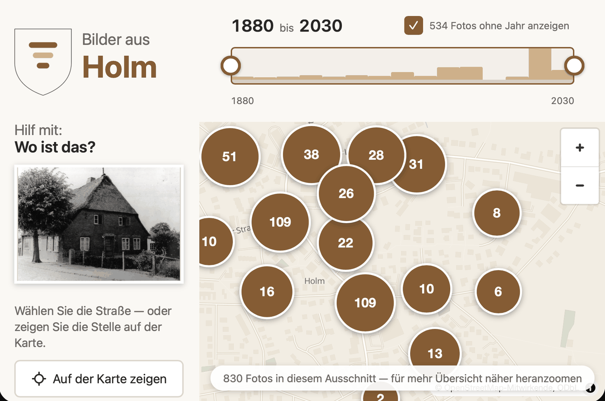
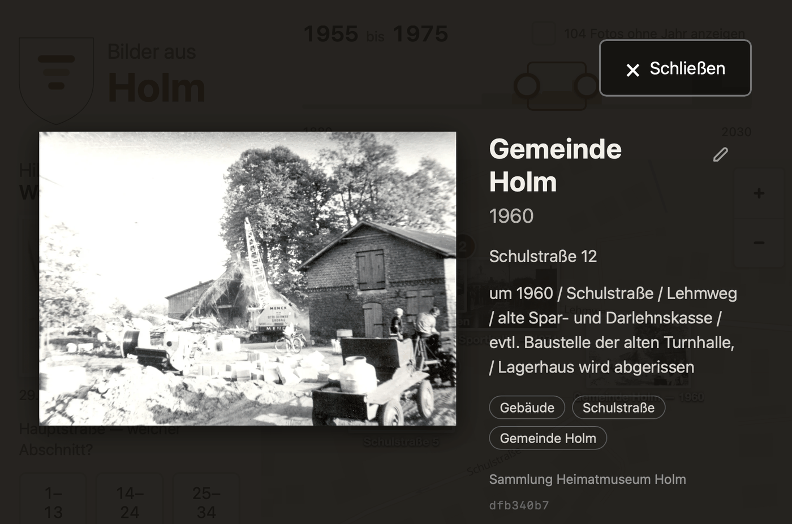
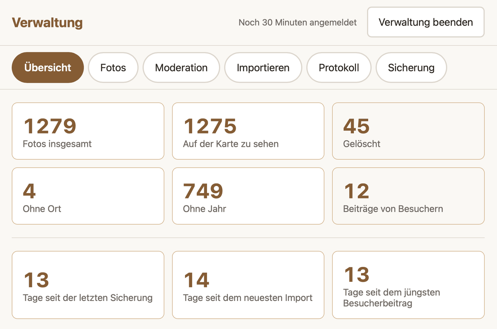

<!-- translated-from: docs/museum/index.md -->
<!-- source-sha: 6804c83f65bbdb99f2b460d00a1a2376ebd7fb0eb45262274263457884c63372 -->

# Kiekmap

Historische Ortsfotos auf einer Karte entdecken, Jahrzehnt für Jahrzehnt. Ein Touchscreen-Kiosk
fürs Heimatmuseum: Läuft offline auf einem Raspberry Pi, lässt sich an jeden Ort anpassen, und die
Besucher ergänzen, was fehlt.

Das Gerät steht im Museum, läuft **ganz offline** im Kioskmodus und wird gesichert, indem man
einen USB-Stick einsteckt und einen Knopf drückt. Es bootet direkt in die Karte — kein Login, kein
Desktop, keine Bedienung nötig.

Besucher schieben einen Zeitregler und sehen die Fotos dieser Zeit an der Stelle, an der sie
aufgenommen wurden. Ein Antippen öffnet das Bild groß, mit allem, was das Museum darüber weiß.

Die meisten historischen Fotos kommen ohne Datum und ohne Adresse an. Genau danach fragt der
„Hilf mit"-Bereich die Besucher, eine Frage nach der anderen, und die Antworten gehen in den
Bestand, nachdem jemand aus dem Museum sie angesehen hat.

Die Ansicht für das Museum zeigt den Stand des Bestands und führt direkt in die Arbeit: welche
Fotos kein Jahr haben, welche keinen Ort, und was Besucher seither beigetragen haben.

## Wie es weitergeht

**[Fotos hinzufügen und sichern](usermanual.de.md)** — die Anleitung für das Museumsteam. Wie
Bilder auf das Gerät kommen, wie sich ergänzen lässt, was fehlt, und wie der ganze Bestand auf
einen USB-Stick geschrieben wird. Zum Ausdrucken und Neben-das-Gerät-Legen gedacht.

**[Das Gerät betreiben](operations.de.md)** — für den, der es am Laufen hält. Den Raspberry Pi
einrichten, ohne Internet aktualisieren, eine Sicherung zurückspielen, und was zu tun ist, wenn
der Bildschirm schwarz bleibt.

**[Für einen anderen Ort einrichten](adaption.de.md)** — für ein zweites Museum. Kartenausschnitt,
Ortsverzeichnis, Wappen und Sprache sind Konfiguration; nichts davon steht im Code, und ein Fork
ist nicht nötig.

**[Die erste Sammlung aufbauen](collection.de.md)** — für die einmalige Arbeit am Anfang. Wie ein
Archiv aus ein paar tausend Scans über die Kommandozeile in das Gerät kommt, was der Import aus
einer Datei liest, und was die Zahlen danach bedeuten.

**[Weitergabe](licensing.de.md)** — was weitergegeben werden darf und unter welchen Bedingungen.
Der Fotobestand fällt nicht unter die Softwarelizenz, und die Kartendaten bringen eine eigene
Pflicht mit.

> **Nichts davon ist auf einem echten Raspberry Pi erprobt.** Alles, was das Gerät selbst betrifft,
> wurde ohne eines gebaut. Kioskbetrieb, der USB-Weg der Sicherung und das Verhalten nach einem
> Stromausfall sind deshalb ungeprüft, und der erste echte Aufbau ist zugleich die Abnahme. Was
> sich ohne Gerät prüfen lässt, ist geprüft: Die Container bauen und laufen, und die Seite fragt
> nichts Fremdes an.
