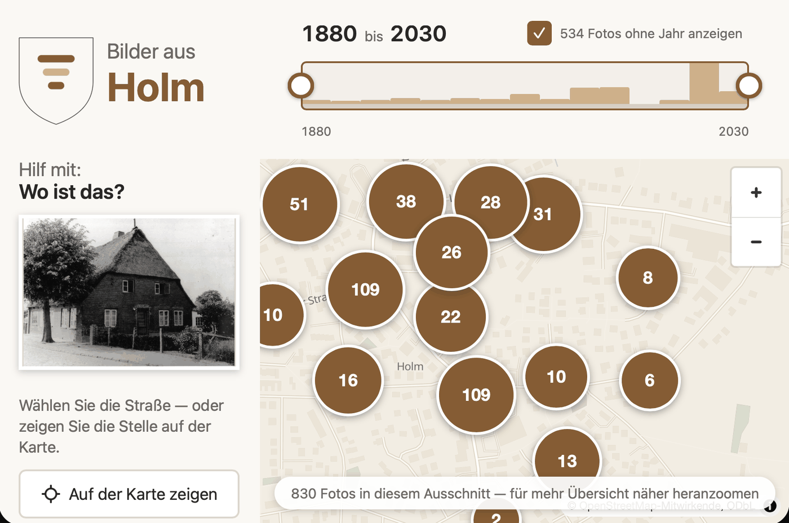

# Kiekmap

Discover historic pictures of a village on a map, decade by decade. A touchscreen kiosk for a
local history museum: it runs offline on a Raspberry Pi, adapts to any place, and the visitors
fill in what is missing.

The device stands in the museum, runs **entirely offline** in kiosk mode, and is backed up by
plugging in a USB stick and pressing one button. It boots straight into the map — no login, no
desktop, nothing to operate.

Visitors move a time slider and see the photographs of that period at the place they were taken.
Tapping one opens it at full size, with everything the museum knows about it.

Most historic photographs arrive without a date and without an address. The contribution panel
asks visitors for exactly that, one question at a time, and the answers go into the collection
after somebody from the museum has looked at them.

The museum's own view shows the state of the collection and leads straight into the work: which
photos have no year, which have no place, what visitors have contributed since.

## Where to go from here

**[Adding photos and backing them up](usermanual.md)** — the guide for the museum team. How to get
pictures onto the device, how to fill in what is missing, and how to write the whole collection
onto a USB stick. Made to be printed and left beside the device.

**[Running the device](operations.md)** — for whoever keeps it going. Setting up the Raspberry Pi,
updating without an internet connection, reading a backup back in, and what to do when the screen
stays black.

**[Setting it up for another place](adaption.md)** — for a second museum. The map extent, the place
index, the coat of arms and the language are configuration; none of it is in the code, and no fork
is needed.

**[Passing it on](licensing.md)** — what may be given away and under which conditions. The photo
collection is not covered by the software licence, and the map data brings an obligation of its
own.

> **None of this has been tried on a real Raspberry Pi.** Everything about the device itself was
> built without one. Kiosk operation, the USB path of the backup and the behaviour after a power
> cut are therefore unverified, and the first real setup is at the same time the acceptance test.
> What can be checked without a device is checked: the containers build and run, and the page
> requests nothing from a foreign origin.
